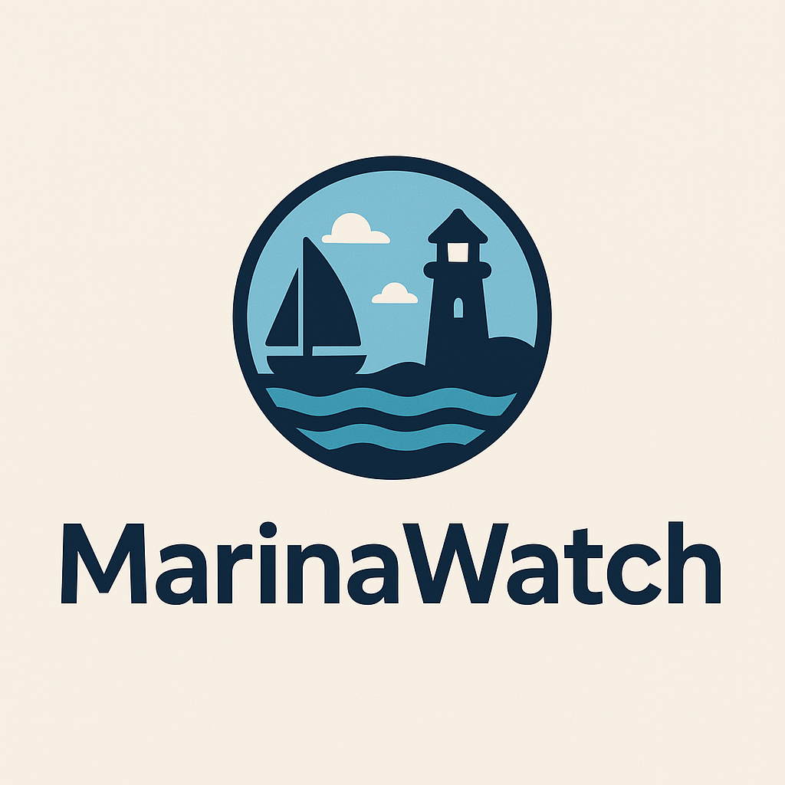

# 🌊 MarinaWatch

**MarinaWatch** is an open-source platform for tracking, comparing, and forecasting marina berth prices across regions and years. Users can contribute data such as vessel name, location, price, and notes — and visualize trends through interactive charts and maps.



---

## 📦 Features

- 📈 Visualize marina price trends over the years
- 🧭 Interactive map with region and country filters
- 📊 Graphs comparing vessel size and pricing
- 🧮 Forecast future marina costs (coming soon)
- 📝 Community-contributed entries via GitHub Issues
- 🌙 Dark mode support
- 🔄 CSV / JSON data import-export (planned)

---

## 🧠 Use Cases

- Boat owners comparing seasonal berthing costs  
- Investors looking at regional price trends  
- Travelers and liveaboards planning routes and budgets  
- Marina managers benchmarking prices  

---

## 📁 Data Format Example

```json
{
  "vessel": "Sea Breeze",
  "year": 2023,
  "price": 3500,
  "size_ft": 32,
  "type": "yacht",
  "country": "Turkey",
  "region": "Aegean",
  "lat": 37.0344,
  "lng": 27.4303,
  "notes": "Includes winter storage"
}
```

---

## 🛠️ Getting Started

1. **Clone the repo**
   ```bash
   git clone https://github.com/makalin/MarinaWatch.git
   cd MarinaWatch
   ```

2. **Install dependencies**
   ```bash
   npm install
   ```

3. **Run the app**
   ```bash
   npm run dev
   ```

---

## 🚀 Deploying to GitHub Pages

Already configured via GitHub Actions. Push to `main` and it will auto-deploy.  
Live version will appear at:  
`https://makalin.github.io/MarinaWatch`

---

## 🙌 Contributing

We welcome community data and feedback!

- 👉 [Add a New Entry](https://github.com/makalin/MarinaWatch/issues/new?template=new-entry.md)
- ⭐ Star the repo if you like the project
- 🐛 Found a bug? Open an issue!

---

## 📃 License

MIT License © Mehmet T. AKALIN
